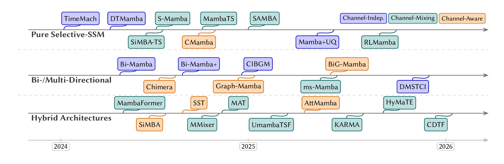

# Awesome Mamba for Time Series

[](https://awesome.re)
[](https://github.com/tamlhp/awesome-mamba-ts/stargazers)


A living index of academic papers, implementations, datasets, benchmarks, and practical guidance for **Mamba and selective state space models for time-series forecasting**.


- [Taxonomy](#taxonomy)
- [Foundations and Baselines](#foundations-and-baselines)
- [Pure Selective-SSM Forecasters](#pure-selective-ssm-forecasters)
- [Bidirectional and Multi-Directional Scans](#bidirectional-and-multi-directional-scans)
- [Hybrid Architectures](#hybrid-architectures)
- [Specialized Designs](#specialized-designs)
- [Implementation Registry](#implementation-registry)
- [Datasets and Benchmarks](#datasets-and-benchmarks)
- [Evaluation Metrics](#evaluation-metrics)
- [Practical Guidelines](#practical-guidelines)
- [Contributing](#contributing)

<!-- ## Citation

If you use this repository, please cite the survey manuscript. A public DOI or finalized venue entry will be added once the paper metadata is finalized.

```bibtex
@misc{pham2026mamba-time-series,
  title = {Mamba for Time Series: A Contemporary Survey},
  author = {Anonymous Authors},
  year = {2026},
  note = {Survey manuscript},
  url = {https://github.com/tamlhp/awesome-mamba-ts}
}
```
-->

## Taxonomy



The survey organizes Mamba-based time-series forecasting along five design axes:

- **Tokenization**: pointwise, patch, channel-as-token, event-token, or multi-scale tokenization.
- **Channel strategy**: channel-independent (CI), channel-dependent/channel-mixing (CD), channel-correlated (CC), or dual time/channel mixers.
- **Directional scan**: forward-only, bidirectional, multi-scale parallel, or 2D joint-axis selective scans.
- **Hybridization**: pure Mamba, Mamba + attention, Mamba + MLP/EinFFT, Mamba + CNN/convolution, or Mamba + decomposition.
- **Decomposition**: none, trend-seasonal, multi-scale, Fourier/frequency, or cross-domain time-frequency decomposition.


## Foundations and Baselines

These papers define the SSM lineage, Mamba backbone, and time-series baselines used throughout the survey.

| Paper | Year | Category | Venue / Source | Code |
| --- | --- | --- | --- | --- |
| HiPPO: Recurrent Memory with Optimal Polynomial Projections | 2020 | SSM foundation | NeurIPS | - |
| Efficiently Modeling Long Sequences with Structured State Spaces | 2022 | S4 / structured SSM | ICLR | - |
| Simplified State Space Layers for Sequence Modeling | 2023 | S5 / simplified SSM | ICLR | - |
| [Mamba: Linear-Time Sequence Modeling with Selective State Spaces](https://arxiv.org/abs/2312.00752) | 2023 | Selective SSM | arXiv | [Code](https://github.com/state-spaces/mamba) |
| Transformers are SSMs: Generalized Models and Efficient Algorithms Through Structured State Space Duality | 2024 | Mamba-2 / SSD | ICML | [Code](https://github.com/state-spaces/mamba) |
| Informer: Beyond Efficient Transformer for Long Sequence Time-Series Forecasting | 2021 | Efficient Transformer baseline | AAAI | [Code](https://github.com/zhouhaoyi/Informer2020) |
| Autoformer: Decomposition Transformers with Auto-Correlation for Long-Term Series Forecasting | 2021 | Decomposition Transformer baseline | NeurIPS | [Code](https://github.com/thuml/Autoformer) |
| A Time Series is Worth 64 Words: Long-Term Forecasting with Transformers | 2023 | Patch Transformer baseline | ICLR | [Code](https://github.com/yuqinie98/PatchTST) |
| iTransformer: Inverted Transformers Are Effective for Time Series Forecasting | 2024 | Channel-as-token baseline | ICLR | [Code](https://github.com/thuml/iTransformer) |
| Are Transformers Effective for Time Series Forecasting? | 2023 | Linear baseline | AAAI | [Code](https://github.com/cure-lab/LTSF-Linear) |
| N-BEATS: Neural Basis Expansion Analysis for Interpretable Time Series Forecasting | 2020 | MLP / basis expansion baseline | ICLR | - |
| N-HiTS: Neural Hierarchical Interpolation for Time Series Forecasting | 2023 | Multi-rate baseline | AAAI | [Code](https://github.com/Nixtla/neuralforecast) |
| TimesNet: Temporal 2D-Variation Modeling for General Time Series Analysis | 2023 | 2D temporal baseline | ICLR | [Code](https://github.com/thuml/TimesNet) |
| Reversible Instance Normalization for Accurate Time-Series Forecasting Against Distribution Shift | 2022 | Normalization | ICLR | [Code](https://github.com/ts-kim/RevIN) |

## Pure Selective-SSM Forecasters

Pure forecasters replace the main forecasting backbone with Mamba or a closely related SSM block, usually with RevIN preprocessing and a linear prediction head. They are the strongest starting point when the lookback window is long and stable cross-channel structure is weak.

| Paper / Method | Year | Category | Venue / Source | Code |
| --- | --- | --- | --- | --- |
| Mamba Time Series Forecasting with Uncertainty Quantification | 2025 | Patch-based pure SSM; probabilistic head | MLST | [Code](https://github.com/PengchengWeifr/Mamba_TSF_UQ) |
| [RLMamba: Integrating Residual Learning With Mamba for Long-Term Time Series Forecasting](https://doi.org/10.1016/j.eswa.2025.127362) | 2025 | Residual pure SSM | Expert Systems with Applications | announced |
| [FedRMamba: Federated Residual Mamba for Multivariate Time-Series Forecasting](https://doi.org/10.1145/3774904.3792712) | 2025 | Federated residual Mamba | WWW Companion | announced |
| [GCMNet: A Global Context Mamba Network for Long-Term Time Series Forecasting](https://doi.org/10.1016/j.patcog.2026.113287) | 2026 | Global-context pure SSM | Pattern Recognition | announced |
| Is Mamba Effective for Time Series Forecasting? / S-Mamba | 2025 | Channel-as-token pure SSM | Neurocomputing | [Code](https://github.com/wzhwzhwzh0921/S-D-Mamba) |
| Is Mamba Effective for Time Series Forecasting? | 2024 | Negative / protocol study | Neurocomputing | [Code](https://github.com/wzhwzhwzh0921/S-D-Mamba) |
| [MambaTS: Improved Selective State Space Models for Long-Term Time Series Forecasting](https://arxiv.org/abs/2405.16440) | 2024 | VAST learned scan order | arXiv | [Code](https://github.com/XiudingCai/MambaTS-pytorch) |
| [SAMBA: Simplified Mamba-Based Architecture for Time Series Forecasting](https://arxiv.org/abs/2410.03707) | 2024 | Gate-free Mamba block | arXiv | [Code](https://github.com/mshliang/SAMBA) |
| [DTMamba: Dual Twin Mamba for Time Series Forecasting](https://arxiv.org/abs/2404.07336) | 2024 | Dual forward/reverse pure SSM | arXiv | [Code](https://github.com/lizyelon/DTMamba) |
| TimeMachine: A Time Series is Worth 4 Mambas for Long-Term Forecasting | 2024 | Multi-scale pure SSM | ECAI | [Code](https://github.com/Atik-Ahamed/TimeMachine) |
| [SiMBA-TS: Simplified Channel Mixing and Mamba for Long-Term Time Series Forecasting](https://arxiv.org/abs/2403.15360) | 2024 | Patch-based pure SSM with channel mixer | arXiv | [Code](https://github.com/badripatro/Simba) |
| [C-Mamba: Channel Correlation Enhanced State Space Models for Multivariate Time Series Forecasting](https://arxiv.org/abs/2406.05316) | 2024 | Channel-correlation graph | arXiv | [Code](https://github.com/chenhan-y/C-Mamba) |
| [CMamba: Channel Correlation Enhanced State Space Models for Multivariate Time Series Forecasting](https://arxiv.org/abs/2406.05316) | 2024 | Global cross-channel mixer | arXiv | [Code](https://github.com/zshhans/CMamba) |
| [CMMamba: Channel Mixing Mamba for Time Series Forecasting](https://doi.org/10.1186/s40537-024-01001-9) | 2024 | Channel-mixing Mamba | Journal of Big Data | announced |
| [MambaStock: Selective State Space Model for Stock Prediction](https://arxiv.org/abs/2402.18959) | 2024 | Finance pure SSM | arXiv | [Code](https://github.com/zshicode/MambaStock) |
| DGMamba: Domain Generalization via Generalized State Space Model | 2024 | Domain-generalized Mamba | ACM MM | [Code](https://github.com/longshaocong/DGMamba) |
| [Mamba4Cast: Efficient Zero-Shot Time Series Forecasting with State Space Models](https://arxiv.org/abs/2410.09385) | 2024 | Zero-shot / foundation-style Mamba | arXiv | [Code](https://github.com/automl/mamba4cast) |
| Effectively Modeling Time Series with Simple Discrete State Spaces | 2023 | Pre-Mamba SSM foundation forecaster | ICLR | [Code](https://github.com/HazyResearch/spacetime) |

## Bidirectional and Multi-Directional Scans

This branch modifies Mamba's native unidirectional scan. Bidirectional scans improve context symmetry for forecasting, while multi-scale and 2D scans target long-horizon or high-channel multivariate data.

| Paper / Method | Year | Category | Direction / Fusion | Venue / Source | Code |
| --- | --- | --- | --- | --- | --- |
| [ms-Mamba: Multi-scale Mamba for Time-Series Forecasting](https://arxiv.org/abs/2504.07654) | 2025 | Multi-scale scan | Parallel scans + MLP | arXiv | [Code](https://github.com/airin/ms-Mamba) |
| [BiG-Mamba: Bidirectional Graph and Mamba Modeling for Multivariate Time Series Forecasting](https://doi.org/10.1007/978-981-96-9946-9_26) | 2025 | Graph bidirectional scan | Forward + reverse + graph attention | LNCS / Springer | announced |
| Hierarchical Information-Guided Spatio-Temporal Mamba for Stock Time Series Forecasting | 2025 | Spatio-temporal bidirectional Mamba | Spatial + temporal scans | Information Sciences | announced |
| [Decomposed Multi-Scale Temporal-Channel Interaction with Bidirectional Mamba for Multivariate Time Series Forecasting](https://doi.org/10.2139/ssrn.5382999) | 2025 | Decomposed multi-scale bidirectional Mamba | Trend/seasonal branches | SSRN | announced |
| [Bi-Mamba4TS: Bidirectional Mamba for Time Series Forecasting](https://arxiv.org/abs/2404.15772) | 2024 | Symmetric bidirectional scan | Forward + reverse concat | arXiv | [Code](https://github.com/llwwqq/Bi-Mamba) |
| [Bi-Mamba+: Bidirectional Mamba for Time Series Forecasting](https://arxiv.org/abs/2404.15772) | 2024 | Bidirectional scan with SRA module | Forward + reverse concat | arXiv | [Code](https://github.com/llwwqq/Bi-Mamba-plus) |
| [Bi-Mamba: Bidirectional Mamba for Time Series Forecasting](https://arxiv.org/abs/2404.15772) | 2024 | Univariate bidirectional variant | Shared encoder + projection | arXiv | [Code](https://github.com/llwwqq/Bi-Mamba) |
| Channel Independence Bidirectional Gated Mamba With Interactive Recurrent Mechanism for Time Series Forecasting | 2024 | Bidirectional gated Mamba | Interactive recurrent gate | Neurocomputing | [Code](https://github.com/CIBGM/CIBGM) |
| [Mamba Meets Financial Markets: A Graph-Mamba Approach for Stock Price Prediction](https://arxiv.org/abs/2410.03707) | 2024 | Graph bidirectional Mamba | Forward + reverse + graph conv | arXiv | [Code](https://github.com/Ali-Meh619/SAMBA) |
| TimeMachine: A Time Series is Worth 4 Mambas for Long-Term Forecasting | 2024 | Multi-resolution Mamba | 4 parallel branches + MLP | ECAI | [Code](https://github.com/Atik-Ahamed/TimeMachine) |
| Chimera: Effectively Modeling Multivariate Time Series with 2-Dimensional State Space Models | 2024 | 2D joint-axis scan | Time x channel selective scan | NeurIPS | announced |

## Hybrid Architectures

Hybrid models combine Mamba with modules that compensate for weaknesses of pure selective scans: attention for content selection, MLP/EinFFT mixers for channel mixing, CNNs for local patterns, and decomposition or Fourier blocks for multi-frequency structure.

| Paper / Method | Year | Category | Hybrid Component | Venue / Source | Code |
| --- | --- | --- | --- | --- | --- |
| [Cross-Domain Time-Frequency Mamba: A More Effective Model for Long-Term Time Series Forecasting](https://doi.org/10.1016/j.knosys.2026.115341) | 2026 | Time-frequency hybrid | Coupled time/frequency Mamba scans | Knowledge-Based Systems | announced |
| Attention Mamba: Time Series Modeling with Adaptive Pooling Acceleration and Receptive Field Enhancements | 2025 | Attention hybrid | Adaptive pooling + attention + Mamba | IEEE Access | announced |
| [DIMformer: A Dynamic Inverted Transformer With Mamba-Cross-Variable Linear Attention for Multivariate Time Series Forecasting](https://doi.org/10.1109/ACCESS.2025.3645346) | 2025 | Attention hybrid | Mamba-cross-variable linear attention | IEEE Access | announced |
| HyMaTE: A Hybrid Mamba and Transformer Model for EHR Representation Learning | 2025 | Healthcare attention hybrid | Mamba temporal encoder + Transformer channel mixer | ACM BCB | [Code](https://github.com/healthylaife/HyMaTE) |
| Affirm: Interactive Mamba with Adaptive Fourier Filters for Long-Term Time Series Forecasting | 2025 | Fourier hybrid | Adaptive Fourier filters | AAAI | [Code](https://github.com/congyutao0725/AFFIRM) |
| [KARMA: A Multilevel Decomposition Hybrid Mamba Framework for Multivariate Long-Term Time Series Forecasting](https://arxiv.org/abs/2506.08939) | 2025 | Decomposition hybrid | STL-style multilevel decomposition | arXiv | [Code](https://github.com/yedadasd/KARMA) |
| CMDMamba: Dual-Layer Mamba Architecture with Dual Convolutional Feed-Forward Networks for Efficient Financial Time Series Forecasting | 2025 | CNN hybrid | Depthwise and dilated convolutional FFNs | Knowledge-Based Systems | [Code](https://github.com/JadenZheng/CMDMamba) |
| [TimeMamba: A Mamba-Based Long-Term Time Series Forecasting Method with Fourier Analysis](https://arxiv.org/abs/2502.03430) | 2025 | Frequency/CNN hybrid | Fourier branch + Mamba | arXiv | announced |
| [Integration of Mamba and Transformer - MAT for Long-Short Range Time Series Forecasting with Application to Weather Dynamics](https://arxiv.org/abs/2409.08530) | 2024 | Attention hybrid | Mamba branch + Transformer branch | arXiv | [Code](https://github.com/mwxinnn/MAT) |
| [SST: Multi-Scale Hybrid Mamba-Transformer Experts for Time Series Forecasting](https://arxiv.org/abs/2404.14757) | 2024 | Mixture-of-experts attention hybrid | Mamba/Transformer experts + sparse gate | arXiv | [Code](https://github.com/XiongxiaoXu/SST) |
| [FMamba: Mamba Based on Fast-Attention for Multivariate Time-Series Forecasting](https://arxiv.org/abs/2407.14814) | 2024 | Fast-attention hybrid | Fast linear attention inside Mamba stack | arXiv | [Code](https://github.com/XieFanrong/FMamba) |
| [Can Mamba Learn How to Learn? A Comparative Study on In-Context Learning Tasks](https://arxiv.org/abs/2402.04248) / MambaFormer | 2024 | Mamba-Transformer interleaving | Alternating Mamba and Transformer blocks | arXiv | [Code](https://github.com/Alexia-Jolicoeur-Martineau/Mamba) |
| [SiMBA: Simplified Mamba-Based Architecture for Vision and Multivariate Time Series](https://arxiv.org/abs/2403.15360) | 2024 | EinFFT / MLP mixer hybrid | EinFFT channel mixer + Mamba time mixer | arXiv | [Code](https://github.com/badripatro/Simba) |
| [MambaMixer: Efficient Selective State Space Models with Dual Token and Channel Selection](https://arxiv.org/abs/2403.19888) | 2024 | MLP-Mixer style hybrid | Dual token/channel selective scans | arXiv | [Code](https://github.com/behrouzs/MambaMixer) |
| [UmambaTSF: A U-Shaped Multi-Scale Long-Term Time Series Forecasting Method Using Mamba](https://arxiv.org/abs/2410.11278) | 2024 | U-Net / CNN hybrid | U-shaped encoder-decoder with Mamba blocks | arXiv | [Code](https://github.com/lianghao228/UmambaTSF) |

## Specialized Designs

Specialized models are driven by an application domain or deployment constraint rather than by a generic backbone change. They often reuse methods from the previous branches but add domain structure, graph priors, cross-domain losses, federated aggregation, or foundation-model pretraining.

| Method | Year | Area | Backbone | Channel | Pretraining / Deployment | Code |
| --- | --- | --- | --- | --- | --- | --- |
| [BiG-Mamba](https://doi.org/10.1007/978-981-96-9946-9_26) | 2025 | Spatio-temporal | Bi-Mamba + graph | CC | - | announced |
| Affirm | 2025 | Climate / weather | Mamba + FFT | CD | - | [Code](https://github.com/congyutao0725/AFFIRM) |
| CMDMamba | 2025 | Finance | Mamba + CNN | CD | - | [Code](https://github.com/JadenZheng/CMDMamba) |
| HSTM | 2025 | Finance / spatial | Spatial + temporal Mamba | CC | - | announced |
| HyMaTE | 2025 | Healthcare / EHR | Mamba + Transformer | CC | - | [Code](https://github.com/healthylaife/HyMaTE) |
| [FedRMamba](https://doi.org/10.1145/3774904.3792712) | 2025 | Federated forecasting | Mamba | CI | Federated residual updates | announced |
| Chimera | 2024 | Spatio-temporal | 2D Mamba | CD | - | announced |
| [MAT](https://arxiv.org/abs/2409.08530) | 2024 | Climate / weather | Mamba + attention | CD | - | [Code](https://github.com/mwxinnn/MAT) |
| [MambaStock](https://arxiv.org/abs/2402.18959) | 2024 | Finance | Pure Mamba | CI | - | [Code](https://github.com/zshicode/MambaStock) |
| [Graph-Mamba](https://arxiv.org/abs/2410.03707) | 2024 | Finance / graph | Bi-Mamba + GCN | CC | - | [Code](https://github.com/Ali-Meh619/SAMBA) |
| DGMamba | 2024 | Domain generalization | Mamba | CI | Domain-invariant loss | [Code](https://github.com/longshaocong/DGMamba) |
| [Mamba4Cast](https://arxiv.org/abs/2410.09385) | 2024 | Zero-shot forecasting | Mamba | CI | Synthetic pretraining; GIFT-Eval | [Code](https://github.com/automl/mamba4cast) |
| SpaceTime | 2023 | Foundation / pre-Mamba SSM | SSM | CI | Foundation-style SSM forecaster | [Code](https://github.com/HazyResearch/spacetime) |


## Datasets and Benchmarks

| Dataset / Benchmark | Domain | Length | Channels | Frequency | Used by examples |
| --- | --- | --- | --- | --- | --- |
| ETTh1, ETTh2 | Electricity | 17,420 | 7 | 1h | All systems |
| ETTm1, ETTm2 | Electricity | 69,680 | 7 | 15m | All systems |
| Electricity | Electricity | 26,304 | 321 | 1h | C-Mamba, CMamba, CMMamba, MambaMixer |
| Traffic | Transportation | 17,544 | 862 | 1h | Chimera, S-Mamba, GCMNet, DIMformer |
| Weather | Climate | 52,696 | 21 | 10m | MAT, Affirm, KARMA, CDTF-Mamba |
| Solar-Energy | Energy | 52,560 | 137 | 10m | S-Mamba, Bi-Mamba+, RLMamba |
| ILI | Health | 966 | 7 | 1w | TimeMachine, MambaTS, Mamba+UQ |
| PEMS04 | Traffic | 16,992 | 307 | 5m | Chimera, HSTM, BiG-Mamba |
| PEMS08 | Traffic | 17,856 | 170 | 5m | Chimera, HSTM |
| Exchange-Rate | Finance | 7,588 | 8 | 1d | MambaStock, MambaTS, CMDMamba |
| Stock A-share / S&P 500 | Finance | varies | varies | 1d | MambaStock, CMDMamba, HSTM |
| GIFT-Eval | Multi-domain | varies | varies | varies | Mamba4Cast |
| Monash Forecasting Repository | Multi-domain | varies | varies | varies | Mamba4Cast pretraining and evaluation |


## Evaluation Metrics

| Metric | Family | What it measures | Suitable use |
| --- | --- | --- | --- |
| MSE | Point forecast | Mean squared deviation over horizon and channels | Peak-sensitive energy, weather, and Gaussian-residual regimes |
| MAE | Point forecast | Mean absolute deviation | Robust comparison under heavy-tailed spikes |
| RMSE | Point forecast | MSE in original units | Human-readable absolute error scale |
| MAPE | Scale-free | Average relative error | Strictly positive non-zero targets across scales |
| SMAPE | Scale-free | Symmetric bounded relative error | Cross-series comparison when targets are small but not zero |
| MASE | Scale-free | MAE relative to naive or seasonal naive forecast | Monash-style cross-dataset skill aggregation |
| CRPS | Probabilistic | Calibration and sharpness of predictive CDF | Probabilistic forecasts such as Mamba+UQ |
| NLL | Probabilistic | Likelihood under predictive distribution | Explicit probabilistic decoders with trusted distribution family |
| Hit rate | Directional | Sign/direction accuracy | Finance, regime detection, and change-point tasks |
| Params / FLOPs | Efficiency | Model size and theoretical compute | Hardware-independent architecture comparison |
| Latency | Efficiency | Forward-pass wall time at fixed lookback and horizon | Deployment and long-context serving cost |

## Disclaimer

Feel free to contact us if you have any queries or exciting news on Mamba for time series. In addition, we welcome all researchers to contribute to this repository and further contribute to the knowledge of Mamba for time series fields. It would be great if contributions keep the repository aligned with the survey taxonomy

If you have some other related references, please feel free to create a Github issue with the paper information. We will glady update the repos according to your suggestions. (You can also create pull requests, but it might take some time for us to do the merge)

-----------
**Backup Statistics**


