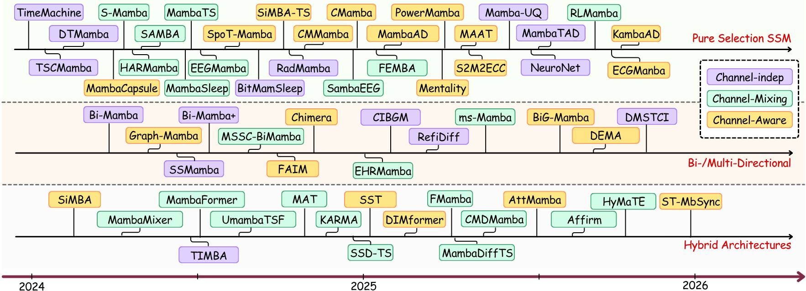
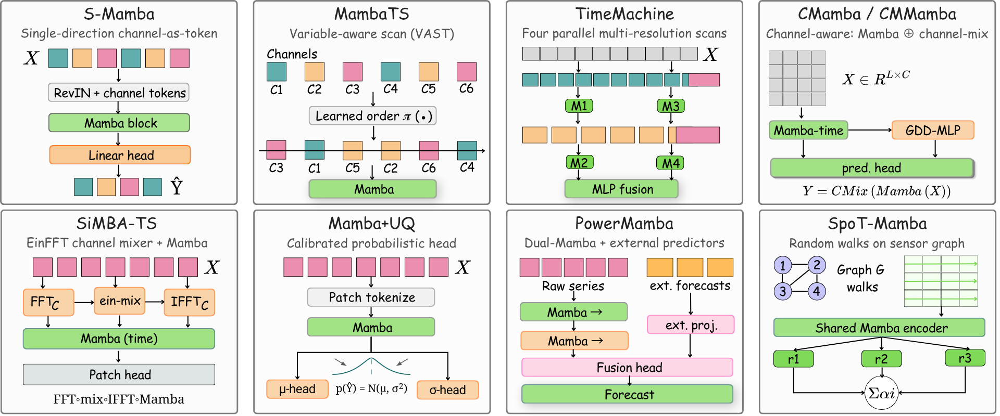
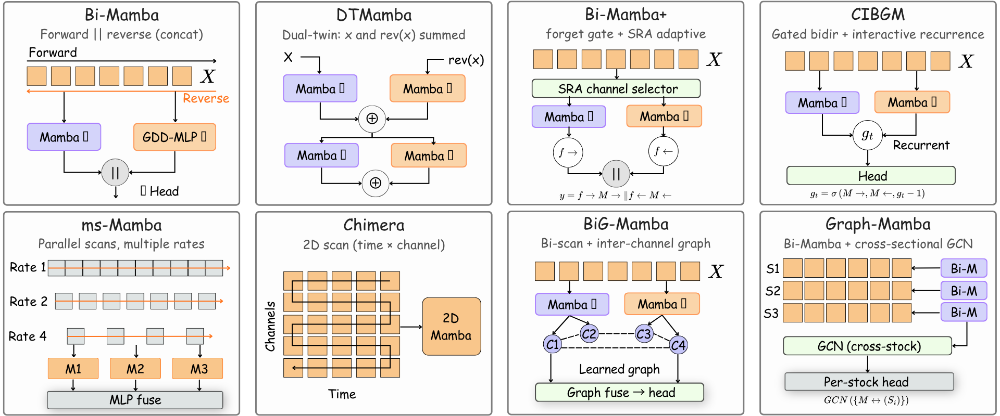
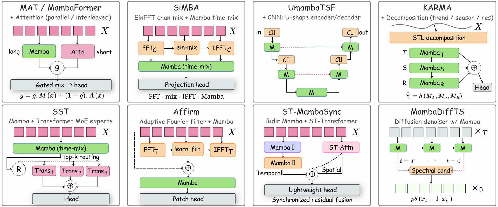

# Awesome Mamba for Time Series

[](https://awesome.re)
[](https://github.com/tamlhp/awesome-mamba-ts/stargazers)


A living index of academic papers, implementations, datasets, benchmarks, and practical guidance for **Mamba and selective state-space models for time-series analysis (TSA)**, covering the **five canonical TSA tasks** (forecasting, classification, anomaly detection, imputation, unified multi-task analytics) and organized around the **three architectural patterns** of the survey: Pure Mamba, Bidirectional / Multi-Directional, and Hybrid.

- [Taxonomy](#taxonomy)
- [Foundations and Baselines](#foundations-and-baselines)
- [Surveyed Mamba-TSA Models](#surveyed-mamba-tsa-models)
  - [Pure Mamba Backbones](#pure-mamba-backbones)
  - [Bidirectional and Multi-Directional Scans](#bidirectional-and-multi-directional-scans)
  - [Hybrid Architectures](#hybrid-architectures)
- [Application Domains](#application-domains)
- [Datasets and Benchmarks](#datasets-and-benchmarks)
- [Evaluation Metrics](#evaluation-metrics)
<!-- - [Practical Guidelines](#practical-guidelines) -->
<!-- - [Open Frontiers](#open-frontiers) -->
- [Disclaimer](#disclaimer)

<!-- ## Citation

If you use this repository, please cite the survey manuscript. A public DOI or finalized venue entry will be added once the paper metadata is finalized.

```bibtex
@misc{pham2026mamba-time-series,
  title  = {Mamba for Time Series Analysis: A Contemporary Survey},
  author = {Anonymous Authors},
  year   = {2026},
  note   = {Survey manuscript},
  url    = {https://github.com/tamlhp/awesome-mamba-ts}
}
```
-->

## Taxonomy



The survey organizes Mamba-TSA methods along **five canonical tasks** (forecasting, classification, anomaly detection, imputation, multi-task analytics) and **five design axes**:

- **Tokenization**: pointwise, patch, channel-as-token, event-token, multi-scale, or multi-view (wavelet/STFT) tokenization.
- **Channel strategy**: channel-independent (CI), channel-dependent / channel-mixing (CD), channel-correlated / graph-based (CC), or dual time/channel mixers.
- **Directional scan**: forward-only, bidirectional, multi-scale parallel, or 2D joint-axis (time × channel) selective scans.
- **Hybridization**: pure Mamba, Mamba + attention, Mamba + diffusion, Mamba + MLP/EinFFT, Mamba + CNN, Mamba + decomposition / Fourier, or Mamba + graph.
- **Decomposition**: none, trend-seasonal (STL/DLinear-style), multi-scale, Fourier/frequency, wavelet, or cross-domain time-frequency.

<!-- A **cross-task design-axis matrix** in the survey identifies three dominating patterns: (i) directional scan splits along causality (only forecasting has a contested directional debate; the other four tasks default to bidirectional); (ii) hybridization is task-conditional (anomaly favors attention, imputation favors diffusion, classification favors spectral / self-supervised front-ends, multi-task favors none-or-mild hybrids); (iii) channel strategy tracks data shape and domain rather than task. -->

## Foundations and Baselines

These papers define the SSM lineage, Mamba backbone, and TSA baselines used throughout the survey.

| Paper | Year | Category | Venue / Source | Code |
| --- | --- | --- | --- | --- |
| [HiPPO: Recurrent Memory with Optimal Polynomial Projections](https://arxiv.org/abs/2008.07669) | 2020 | SSM foundation | NeurIPS | - |
| [Efficiently Modeling Long Sequences with Structured State Spaces](https://arxiv.org/abs/2111.00396) | 2022 | S4 / structured SSM | ICLR | - |
| [Simplified State Space Layers for Sequence Modeling](https://arxiv.org/abs/2208.04933) | 2023 | S5 / simplified SSM | ICLR | - |
| [Mamba: Linear-Time Sequence Modeling with Selective State Spaces](https://arxiv.org/abs/2312.00752) | 2023 | Selective SSM (Mamba-1) | arXiv | [Code](https://github.com/state-spaces/mamba) |
| [Transformers are SSMs: Generalized Models and Efficient Algorithms Through Structured State Space Duality](https://arxiv.org/abs/2405.21060) | 2024 | Mamba-2 / SSD | ICML | [Code](https://github.com/state-spaces/mamba) |
| [Informer: Beyond Efficient Transformer for Long Sequence Time-Series Forecasting](https://arxiv.org/abs/2012.07436) | 2021 | Efficient Transformer baseline | AAAI | [Code](https://github.com/zhouhaoyi/Informer2020) |
| [Autoformer: Decomposition Transformers with Auto-Correlation for Long-Term Series Forecasting](https://arxiv.org/abs/2106.13008) | 2021 | Decomposition Transformer baseline | NeurIPS | [Code](https://github.com/thuml/Autoformer) |
| [A Time Series is Worth 64 Words: Long-Term Forecasting with Transformers](https://arxiv.org/abs/2211.14730) | 2023 | Patch Transformer baseline | ICLR | [Code](https://github.com/yuqinie98/PatchTST) |
| [iTransformer: Inverted Transformers Are Effective for Time Series Forecasting](https://arxiv.org/abs/2310.06625) | 2024 | Channel-as-token baseline | ICLR | [Code](https://github.com/thuml/iTransformer) |
| [Are Transformers Effective for Time Series Forecasting?](https://arxiv.org/abs/2205.13504) | 2023 | Linear baseline (DLinear) | AAAI | [Code](https://github.com/cure-lab/LTSF-Linear) |
| [N-BEATS: Neural Basis Expansion Analysis](https://arxiv.org/abs/1905.10437) | 2020 | MLP / basis expansion baseline | ICLR | - |
| [N-HiTS: Neural Hierarchical Interpolation](https://arxiv.org/abs/2201.12886) | 2023 | Multi-rate baseline | AAAI | [Code](https://github.com/Nixtla/neuralforecast) |
| [TimesNet: Temporal 2D-Variation Modeling for General Time Series Analysis](https://arxiv.org/abs/2210.02186) | 2023 | Cross-task 2D temporal baseline | ICLR | [Code](https://github.com/thuml/TimesNet) |
| [CSDI: Conditional Score-based Diffusion for TS Imputation](https://arxiv.org/abs/2107.03502) | 2021 | Diffusion imputation baseline | NeurIPS | [Code](https://github.com/ermongroup/CSDI) |
| [RevIN: Reversible Instance Normalization](https://arxiv.org/abs/2103.01098) | 2022 | RevIN normalization | ICLR | [Code](https://github.com/ts-kim/RevIN) |

## Surveyed Mamba-TSA Models

The surveyed Mamba-family time-series analysis models, grouped by the **three architectural patterns** and ordered by year (descending) within each pattern. The **Task** column tags the primary task family (Forecast, Class., Anomaly, Imputation, Multi-Task); the **Domain** column marks methods tied to a specific application domain (*General* otherwise); the **Data Shape** column lists the input regime (univariate, multivariate, spatio-temporal graph, or irregular / long-context). Entries marked "– (announced)" list no public repository.

### Pure Mamba Backbones



The *pure* pattern uses Mamba blocks as the sole mixing layer, handling temporal and (optionally) cross-channel mixing through the selective scan, with RevIN-style preprocessing and a linear head.

| Method | Year | Design | Task | Domain | Data Shape | Repository |
| --- | --- | --- | --- | --- | --- | --- |
| [DeMa](https://arxiv.org/abs/2509.13388) | 2026 | dual-path delay-aware | Multi-Task | General | multivariate | – (announced) |
| [Mamba+UQ](https://doi.org/10.1088/2632-2153/adec3b) | 2025 | patch + UQ head | Forecast | General | multivariate | [Code](https://github.com/PengchengWeifr/Mamba_TSF_UQ) |
| [PowerMamba](https://arxiv.org/abs/2412.06112) | 2025 | dual-Mamba forward | Forecast | Energy | multivariate | [Code](https://github.com/alimenati/PowerMamba) |
| [MAC2STI](https://doi.org/10.1016/j.knosys.2025.115301) | 2025 | cluster-aware S6 | Imputation | Traffic / ST | spatio-temporal graph | – (announced) |
| [RadMamba](https://arxiv.org/abs/2502.21099) | 2025 | Doppler patch + Mamba | Class. | Radar / HAR | univariate | – (announced) |
| [RLMamba](https://doi.org/10.1016/j.eswa.2025.127362) | 2025 | residual-learning stack | Forecast | General | multivariate | – (announced) |
| [SAMBA-EEG](https://arxiv.org/abs/2510.20772) | 2025 | differential Mamba | Class. | Healthcare / EEG | multivariate | – (announced) |
| [S-Mamba](https://arxiv.org/abs/2403.11144) | 2024 | channel-token forward | Forecast | General | multivariate | [Code](https://github.com/wzhwzhwzh0921/S-D-Mamba) |
| [MambaTS](https://arxiv.org/abs/2405.16440) | 2024 | pointwise VAST scan | Forecast | General | multivariate | [Code](https://github.com/XiudingCai/MambaTS-pytorch) |
| [SAMBA](https://arxiv.org/abs/2408.12068) | 2024 | channel-token gate-free | Forecast | General | multivariate | [Code](https://github.com/mshliang/SAMBA) |
| [DTMamba](https://arxiv.org/abs/2405.07022) | 2024 | patch dual-twin scan | Forecast | General | multivariate | [Code](https://github.com/lizyelon/DTMamba) |
| [TimeMachine](https://arxiv.org/abs/2403.09898) | 2024 | 4-branch multi-rate | Forecast | General | multivariate | [Code](https://github.com/Atik-Ahamed/TimeMachine) |
| [SiMBA-TS](https://ieeexplore.ieee.org/document/10890315) | 2024 | patch + EinFFT mixer | Forecast | General | multivariate | [Code](https://github.com/badripatro/Simba) |
| [CMamba](https://arxiv.org/abs/2406.05316) | 2024 | patch + GDD ch. mixer | Forecast | General | multivariate | [Code](https://github.com/zclzcl0223/CMamba) |
| [CMMamba](https://doi.org/10.1186/s40537-024-01001-9) | 2024 | bidir. + Top-K ch. mix | Forecast | General | multivariate | – (announced) |
| [MambaStock](https://arxiv.org/abs/2402.18959) | 2024 | lightweight forward scan | Forecast | Finance | univariate | [Code](https://github.com/zshicode/MambaStock) |
| [DGMamba](https://arxiv.org/abs/2404.07794) | 2024 | domain-gen. objective | Forecast | Domain Gen. | multivariate | [Code](https://github.com/longshaocong/DGMamba) |
| [Mamba4Cast](https://arxiv.org/abs/2410.09385) | 2024 | Mamba-2 zero-shot | Forecast | Zero-shot | univariate | [Code](https://github.com/automl/mamba4cast) |
| [Mentality](https://arxiv.org/abs/2408.16486) | 2024 | Mamba SSL foundation | Class. | Healthcare / EEG | multivariate | – (announced) |
| [EHRMamba](https://arxiv.org/abs/2405.14567) | 2024 | EHR foundation | Multi-Task | Healthcare / EHR | irregular / long-context | – (announced) |
| [SpaceTime](https://arxiv.org/abs/2303.09489) | 2023 | pre-Mamba S4 backbone | Forecast | Foundation | multivariate | [Code](https://github.com/HazyResearch/spacetime) |

### Bidirectional and Multi-Directional Scans



This branch modifies Mamba's native unidirectional scan. Bidirectional scans improve context symmetry for non-causal tasks; multi-scale and 2D scans target long-horizon or high-channel multivariate data. All non-forecasting tasks default to this family.

| Method | Year | Design | Task | Domain | Data Shape | Repository |
| --- | --- | --- | --- | --- | --- | --- |
| [BiG-Mamba](https://doi.org/10.1007/978-981-96-9946-9_26) | 2025 | graph + bidir. scan | Forecast | Traffic / ST | spatio-temporal graph | – (announced) |
| [DMSTCI-BiMamba](https://doi.org/10.2139/ssrn.5382999) | 2025 | decomp. multi-scale bidir. | Forecast | General | multivariate | – (announced) |
| [EEG-M²](https://arxiv.org/abs/2502.17873) | 2025 | U-shape Mamba-2 SSL | Class. | Healthcare / EEG | multivariate | [Code](https://github.com/jhong0117/EEG-M2) |
| [FEMBA](https://arxiv.org/abs/2502.06438) | 2025 | Bi-Mamba SSL pretrain | Class. | Healthcare / EEG | multivariate | [Code](https://github.com/pulp-bio/FEMBA) |
| [HSTM](https://arxiv.org/abs/2503.11387) | 2025 | spatial + temporal scans | Forecast | Finance | spatio-temporal graph | – (announced) |
| [MambaAD-IoT](https://doi.org/10.1109/JIOT.2025.3540123) | 2025 | dual Bi-Mamba branches | Anomaly | IoT | multivariate | – (announced) |
| [MambaTAD](https://arxiv.org/abs/2509.01187) | 2025 | contrastive view-discrep. | Anomaly | General | multivariate | – (announced) |
| [ms-Mamba](https://arxiv.org/abs/2504.07654) | 2025 | multi-scale parallel | Forecast | General | multivariate | [Code](https://github.com/airin/ms-Mamba) |
| [S²M²-ECG](https://arxiv.org/abs/2509.10672) | 2025 | multi-branch Bi-SSM | Class. | Healthcare / ECG | multivariate | – (announced) |
| [Bi-Mamba](https://arxiv.org/abs/2404.15772) | 2024 | forward + reverse concat | Forecast | General | multivariate | [Code](https://github.com/llwwqq/Bi-Mamba) |
| [Bi-Mamba+](https://arxiv.org/abs/2404.15772) | 2024 | concat + forget gate | Forecast | General | multivariate | [Code](https://github.com/llwwqq/Bi-Mamba-plus) |
| [Chimera](https://arxiv.org/abs/2406.04320) | 2024 | 2D time × channel scan | Forecast | Traffic / ST | spatio-temporal graph | – (announced) |
| [Chimera (multi-task)](https://arxiv.org/abs/2406.04320) | 2024 | 2D selective scan | Multi-Task | General | spatio-temporal graph | – (announced) |
| [CIBGM](https://doi.org/10.1109/TIE.2025.3581279) | 2024 | forward + reverse gated | Forecast | General | multivariate | [Code](https://github.com/CIBGM/CIBGM) |
| [EEGMamba](https://arxiv.org/abs/2407.20254) | 2024 | Bi-Mamba + MoE | Class. | Healthcare / EEG | multivariate | – (announced) |
| [Graph-Mamba (SAMBA)](https://arxiv.org/abs/2410.03707) | 2024 | graph + forward / reverse | Forecast | Finance | spatio-temporal graph | [Code](https://github.com/Ali-Meh619/SAMBA) |
| [HARMamba](https://arxiv.org/abs/2403.20183) | 2024 | patch + Bi-Mamba | Class. | HAR / Wearable | univariate | – (announced) |
| [Mamba-Sleep](https://arxiv.org/abs/2407.20064) | 2024 | wearable Bi-Mamba | Class. | Healthcare | univariate | – (announced) |
| [SpoT-Mamba](https://arxiv.org/abs/2406.11244) | 2024 | graph walks + Mamba | Forecast | Traffic / ST | spatio-temporal graph | [Code](https://github.com/bdi-lab/SpoT-Mamba) |

### Hybrid Architectures



Hybrid models combine Mamba with modules that compensate for known weaknesses of pure selective scans: attention for content selection, MLP/EinFFT mixers for channel mixing, CNNs for local patterns, diffusion for imputation, decomposition or Fourier blocks for multi-frequency structure, and graphs for spatial coupling. Hybridization is task-conditional: anomaly favors attention, imputation favors diffusion, classification favors spectral / self-supervised front-ends.

| Method | Year | Design | Task | Domain | Data Shape | Repository |
| --- | --- | --- | --- | --- | --- | --- |
| [1D-CNN-ECG-Mamba](https://doi.org/10.1109/TIM.2025.3540123) | 2025 | 1D-CNN + Mamba | Class. | Healthcare / ECG | multivariate | – (announced) |
| [AFFiRM](https://doi.org/10.1609/AAAI.V39I20.35463) | 2025 | patch + adaptive Fourier | Forecast | Climate | multivariate | [Code](https://github.com/congyutao0725/AFFIRM) |
| [AttMamba](https://arxiv.org/abs/2504.02013) | 2025 | patch + adaptive pool. | Forecast | General | multivariate | – (announced) |
| [CMDMamba](https://doi.org/10.3389/frai.2025.1599799) | 2025 | patch + dual CNN | Forecast | Finance | multivariate | [Code](https://github.com/JadenZheng/CMDMamba) |
| [DIMformer](https://doi.org/10.1109/ACCESS.2025.3645346) | 2025 | channel-token + lin. attn. | Forecast | General | multivariate | – (announced) |
| [FAIM](https://arxiv.org/abs/2509.20772) | 2025 | Fourier filt. + Mamba | Class. | General | multivariate | [Code](https://github.com/zhangda1018/FAIM) |
| [HyMaTE](https://doi.org/10.1145/3765612.3767245) | 2025 | event-token + ch. Transf. | Forecast | Healthcare | irregular / long-context | [Code](https://github.com/healthylaife/HyMaTE) |
| [KARMA](https://arxiv.org/abs/2506.08939) | 2025 | patch + MLP + STL | Forecast | General | multivariate | [Code](https://github.com/yedadasd/KARMA) |
| [MAAT](https://arxiv.org/abs/2502.10000) | 2025 | Mamba + sparse attn. | Anomaly | General | multivariate | [Code](https://github.com/mtxslab/MAAT) |
| [RefiDiff](https://arxiv.org/abs/2509.01851) | 2025 | local-ML + Mamba diff. | Imputation | General | irregular / long-context | [Code](https://github.com/AtikAhamed/RefiDiff) |
| [SCMDI](https://doi.org/10.1016/j.eswa.2025.127362) | 2025 | Mamba + causal diffusion | Imputation | IoT | multivariate | – (announced) |
| [ss-Mamba](https://arxiv.org/abs/2510.10672) | 2025 | semantic + spline KAN | Multi-Task | Foundation | multivariate | – (announced) |
| [SSD-TS / DiffImp](https://arxiv.org/abs/2410.13338) | 2025 | Bi-Mamba + diffusion | Imputation | General | multivariate | [Code](https://github.com/HFAiLab/SSD-TS) |
| [ST-MambaSync](https://arxiv.org/abs/2404.15899) | 2025 | bidir. + ST-Transformer | Forecast | Traffic / ST | spatio-temporal graph | [Code](https://github.com/superca729/ST-MAMBASYNC) |
| [TSCMamba](https://arxiv.org/abs/2406.04419) | 2025 | wavelet multi-view + Mamba | Class. | General | multivariate | [Code](https://github.com/AtikAhamed/TSCMamba) |
| [BiT-MamSleep](https://arxiv.org/abs/2411.01589) | 2024 | Bi-Mamba + TRCNN | Class. | Healthcare / Sleep | multivariate | – (announced) |
| [ECGMamba](https://arxiv.org/abs/2406.10098) | 2024 | Bi-SSM + conv | Class. | Healthcare / ECG | multivariate | – (announced) |
| [FMamba](https://arxiv.org/abs/2407.14814) | 2024 | channel-token + fast attn. | Forecast | General | multivariate | [Code](https://github.com/XieFanrong/FMamba) |
| [KambaAD](https://arxiv.org/abs/2410.04918) | 2024 | KAN + attention + Mamba | Anomaly | General | multivariate | – (announced) |
| [MambaCapsule](https://arxiv.org/abs/2411.01851) | 2024 | Mamba + capsule routing | Class. | Healthcare / ECG | multivariate | – (announced) |
| [MambaFormer](https://arxiv.org/abs/2402.04248) | 2024 | patch + interleaved Transf. | Forecast | General | multivariate | [Code](https://github.com/Alexia-Jolicoeur-Martineau/Mamba) |
| [MambaMixer](https://arxiv.org/abs/2403.19888) | 2024 | patch + MLP-Mixer | Forecast | Energy | multivariate | [Code](https://github.com/behrouzs/MambaMixer) |
| [MambaMixer (multi-task)](https://arxiv.org/abs/2403.19888) | 2024 | token + channel sel. MLP | Multi-Task | General | multivariate | [Code](https://github.com/behrouzs/MambaMixer) |
| [MAT](https://arxiv.org/abs/2409.08530) | 2024 | patch + Transformer | Forecast | Climate | multivariate | [Code](https://github.com/mwxinnn/MAT) |
| [MSSC-BiMamba](https://arxiv.org/abs/2405.20142) | 2024 | Bi-Mamba + ECA | Class. | Healthcare / Sleep | multivariate | – (announced) |
| [NeuroNet](https://arxiv.org/abs/2404.17585) | 2024 | Mamba SSL hybrid | Class. | Healthcare / EEG | multivariate | – (announced) |
| [SiMBA](https://arxiv.org/abs/2403.15360) | 2024 | patch + EinFFT | Forecast | General | multivariate | [Code](https://github.com/badripatro/Simba) |
| [SiMBA (multi-task)](https://arxiv.org/abs/2403.15360) | 2024 | Mamba + EinFFT | Multi-Task | General | multivariate | [Code](https://github.com/badripatro/Simba) |
| [SST](https://arxiv.org/abs/2404.14757) | 2024 | patch + MoE Transformer | Forecast | General | multivariate | [Code](https://github.com/XiongxiaoXu/SST) |
| [TIMBA](https://arxiv.org/abs/2410.05916) | 2024 | Bi-Mamba + diffusion + GNN | Imputation | Traffic / ST | spatio-temporal graph | [Code](https://github.com/javiersolisgarcia/TIMBA) |
| [UmambaTSF](https://arxiv.org/abs/2410.11278) | 2024 | patch + U-Net / CNN | Forecast | General | multivariate | [Code](https://github.com/lianghao228/UmambaTSF) |

## Application Domains

Beyond the per-architecture organization, surveyed methods cluster around **seven application domains**. Domain-respecting designs typically outperform general-purpose Mamba variants regardless of which architecture branch the data shape would otherwise select.

| Domain | Representative Methods | Notes |
| --- | --- | --- |
| Healthcare and clinical monitoring | EHRMamba, HyMaTE, EEGMamba, FEMBA, EEG-M², MambaSleep, ECGMamba, MSSC-BiMamba, Mentality | Long, multi-channel biosignals; irregular sampling and EHR streams; foundation pretraining maturing for EEG |
| Energy and electricity | S-Mamba, CMamba, Bi-Mamba+, KARMA, MAT, PowerMamba, MambaMixer (energy) | High-channel grids (Electricity *C*=321); STL/Fourier hybrids when load is decomposable |
| Traffic and spatio-temporal mobility | Chimera, ST-MambaSync, SpoT-Mamba, BiG-Mamba, MAC2STI, TIMBA | PEMS / road-network data; factorized, 2D, and graph-walk scans |
| Climate and weather | MAT, AFFiRM, KARMA, CDTF-Mamba | Narrow-band frequency structure favors Fourier hybrids |
| Finance | MambaStock, CMDMamba, HSTM, Graph-Mamba | Channel-independent backbones with per-stock graph overlays |
| Activity recognition and sensors | HARMamba, RadMamba, MambaSleep | Short-window multivariate; edge-deployed inference |
| Cross-domain and foundation-scale | Mamba4Cast, SpaceTime, DGMamba, FedRMamba, ss-Mamba, EHRMamba | Synthetic pretraining, zero-shot transfer (GIFT-Eval), federated / domain-generalized variants |

## Datasets and Benchmarks

| Dataset / Benchmark | Task | Domain | Length | Channels | Frequency |
| --- | --- | --- | --- | --- | --- |
| [ETTh1, ETTh2](https://github.com/zhouhaoyi/ETDataset) | Forecasting / Imputation | Electricity | 17,420 | 7 | 1h |
| [ETTm1, ETTm2](https://github.com/zhouhaoyi/ETDataset) | Forecasting / Imputation | Electricity | 69,680 | 7 | 15m |
| [Electricity](https://archive.ics.uci.edu/dataset/321/electricityloaddiagrams20112014) | Forecasting | Electricity | 26,304 | 321 | 1h |
| [Traffic](https://pems.dot.ca.gov/) | Forecasting | Transportation | 17,544 | 862 | 1h |
| [Weather](https://www.bgc-jena.mpg.de/wetter/) | Forecasting | Climate | 52,696 | 21 | 10m |
| [Solar-Energy](https://github.com/laiguokun/multivariate-time-series-data) | Forecasting | Energy | 52,560 | 137 | 10m |
| [ILI](https://www.cdc.gov/flu/weekly/) | Forecasting | Health | 966 | 7 | 1w |
| [PEMS04 / PEMS08](https://github.com/guoshnBJTU/ASTGCN/tree/master/data) | Forecasting | Traffic | 16,992–17,856 | 170–307 | 5m |
| [Exchange-Rate](https://github.com/laiguokun/multivariate-time-series-data) | Forecasting | Finance | 7,588 | 8 | 1d |
| [GIFT-Eval](https://github.com/SalesforceAIResearch/gift-eval) | Forecasting (zero-shot) | Multi-domain | varies | varies | varies |
| [Monash Forecasting Repository](https://forecastingdata.org/) | Forecasting (multi-domain) | Multi-domain | varies | varies | varies |
| [UCR Time Series Archive](https://www.cs.ucr.edu/%7Eeamonn/time_series_data_2018/) | Classification | 128 datasets, multi-domain | varies | univariate | varies |
| [UEA Multivariate TS Archive](https://www.timeseriesclassification.com/) | Classification | 30 datasets, multi-domain | varies | multivariate | varies |
| [TUEG / TUSZ / TUAB](https://isip.piconepress.com/projects/tuh_eeg/) | EEG classification | EEG (foundation, seizure, abnormal) | hours | 19–22 | 256 Hz |
| [PTB-XL](https://physionet.org/content/ptb-xl/) | ECG classification | ECG (12-lead) | 10 s | 12 | 100 / 500 Hz |
| [Sleep-EDF / SHHS / MASS](https://physionet.org/content/sleep-edfx/) | Sleep staging | EEG / PSG | 8 h | 2–6 | 100 Hz |
| [HAR / PAMAP2 / WISDM / UNIMIB-SHAR](https://archive.ics.uci.edu/dataset/240/human+activity+recognition+using+smartphones) | HAR | IMU / wearable | varies | 3–18 | 50–100 Hz |
| [SMD, MSL, SMAP, SWaT, PSM](https://github.com/thuml/Anomaly-Transformer) | Anomaly detection | Server / aerospace / industrial | varies | 25–55 | 1m |
| [PhysioNet 2012](https://physionet.org/content/challenge-2012/) | Imputation / classification | ICU (irregular) | 48 h | 41 | irregular |
| [MIMIC-III / MIMIC-IV](https://physionet.org/content/mimiciv/) | Imputation / outcome classification | ICU EHR (irregular) | varies | varies | irregular |
| [TFB](https://github.com/decisionintelligence/TFB) | Forecasting protocol audit | Multi-domain | varies | varies | varies |

## Evaluation Metrics

| Metric | Family | Used in tasks | What it measures |
| --- | --- | --- | --- |
| MSE / MAE / RMSE | Point forecast | Forecasting, imputation | Squared / absolute / scaled deviation |
| MAPE / SMAPE / MASE | Scale-free | Forecasting | Relative error; cross-dataset skill |
| CRPS / NLL | Probabilistic | Forecasting (probabilistic), imputation | Calibration and sharpness of predictive CDF |
| Hit rate | Directional | Finance forecasting, change detection | Sign / direction accuracy |
| Accuracy / Macro-F1 / AUROC / AUPRC | Classification | EEG, ECG, sleep, HAR, TSC | Class discrimination, imbalance-aware variants |
| Cohen's κ | Classification | Sleep staging, multi-rater clinical | Agreement above chance |
| F1 (raw) / F1 with Point Adjustment | Anomaly detection | All AD methods | Point-wise vs. event-wise scoring; **always report both** |
| Precision-at-k / NAB | Anomaly detection | AD with budgeted alerts | Top-k alert quality |
| Imputation MAE / RMSE / CRPS | Imputation | All imputation methods | Reconstruction quality at masked positions |
| Params / FLOPs / Latency | Efficiency | All tasks | Hardware-independent and wall-clock cost |

<!--
## Practical Guidelines

The survey distills four practitioner artifacts:

**1. Cross-Task Design-Axis Matrix.** Five tasks share the backbone, design axes, and pipeline (RevIN normalization, AdamW, fused selective-scan kernel, patch- or channel-tokenized inputs); the recurrent state serves all four heads (forecasting, reconstruction, classification, anomaly) with no per-task tweaks. Specialization patterns: scan direction splits along causality; hybridization is task-conditional; channel strategy tracks data shape and domain rather than task.

**2. Three-Step Decision Rule.**

- **Step 1 — Pick the per-task default.** Forecasting → bidirectional or forward-only scan; anomaly → MAAT-style attention-augmented bidirectional reconstructor; imputation → SSD-TS-style Mamba+diffusion denoiser; classification → TSCMamba/FAIM-style multi-view bidirectional scan; multi-task → Chimera-style 2D scan over (channel × time).
- **Step 2 — Refine by data shape.** Small *C* + weak coupling → channel-independent (TimeMachine, MambaTS, DTMamba). Large *C* + stable structure → channel-as-token (S-Mamba) or dual token+channel (MambaMixer, CMamba). Spatio-temporal graphs → factorized / 2D / graph-walk scans. Irregular or long-context → no off-the-shelf default yet (open frontier).
- **Step 3 — Add a hybrid front-end when data justifies.** Clean trend/seasonal → KARMA. Narrow frequency bands → AFFiRM. Short lookback (*L* ≤ 192) → Transformer hybrids (MAT, SST, MambaFormer).

**3. Configuration Recipes.**

| Knob | Recommended Default |
| --- | --- |
| Lookback length | *L* ∈ {512, 1024} (saturates at 1024); *L*=96 understates Mamba's advantage |
| State / expansion | Mamba-1: *N*=16, *E*=2; Mamba-2: head dim ∈ {64, 128}, *N* ≥ 64; *E* > 2 rarely justifies its cost |
| Tokenization | Patch (*P*=16, stride 8) for low-*C* long-*L*; variate (S-Mamba) for high-*C* |
| Normalization | RevIN on input, de-normalize on output (do not silently disable); LayerNorm / RMSNorm / GroupNorm inside the block |
| Optimizer | AdamW, lr ∈ [10⁻⁴, 10⁻³], weight decay ∈ [0, 0.05]; 10–30 epochs with early stopping |
| Loss | Match reported metric (MAE for CMamba; MSE for S-Mamba, TimeMachine) |
| Precision / kernel | BF16 + FP32 accumulator; fused CUDA kernel from `mamba-ssm`; FlashAttention-2 faster below ~2K tokens |

**4. Mamba-Specific Pitfalls.** Three clusters distort cross-paper comparisons:

- **Implementation numerics:** scan-kernel fidelity (PyTorch reference vs. fused CUDA: 10–30× gap); precision (BF16 + FP32 accumulator standard; FP16 unreliable on long scans); $\Delta_t$ parameterization and state defaults rarely reported.
- **Architectural attribution:** patching alone shifts MSE by several percent; decomposition front-ends (KARMA, AFFiRM) explain most of the gain on periodic data; channel-as-token vs. time-as-token, and forward vs. bidirectional, change numbers silently — match controls with PatchTST-style patching and unidirectional Mamba of equal width/depth.
- **Evaluation protocol:** *L*=96 default neutralizes Mamba's long-range edge (always include long-*L* column); baseline copy-from-table drift; length generalization (*L*test > *L*train) almost never reported despite being the principal theoretical claim; bidirectional baselines for causal forecasting must restrict to lookback or apply along the channel axis; AD threshold protocol must report raw F1 alongside point-adjusted F1; redundant clusters (foundation-EEG: EEGMamba, FEMBA, EEG-M², Mentality, SAMBA-EEG) lack fixed-protocol side-by-side comparison.
-->

<!--
## Open Frontiers

The survey identifies **twelve open frontiers** for Mamba-TSA, each pairing an unresolved tension with a concrete research program:

1. **Attributing gains to selectivity** — does freezing (Δ, B, C) to S5 close the gap?
2. **Input-dependent channel selectivity** — selective gating along the channel axis subsuming Bi-Mamba+ / MambaMixer.
3. **Native irregular-time modeling** — using Δ_t as the observed inter-event gap on MIMIC-III, PhysioNet 2012.
4. **Probabilistic filtering decoders** — closed-form Kalman variance from the SSM structure.
5. **Test-time length generalization** — train at *L*=512, evaluate at *L* ∈ {1024, 2048, 4096, 8192}.
6. **Three-factor gain attribution** — patch × decomposition × backbone ablation as a reporting standard.
7. **Benchmark saturation and the hybrid wall** — retire ETT; commission length-extrapolation / extreme-*C* / irregular-sampling / regime-shift benchmarks.
8. **Foundation-scale pretraining and transfer** — multi-billion-token mixed real / synthetic pretraining, OOD on tail domains, calibrated probabilistic head.
9. **One backbone for all five tasks** — head-conditioned selectivity, principled joint-loss balancing, fixed-protocol cross-task benchmark.
10. **Expressivity and identifiable dynamics** — TC⁰ / state-tracking limits; map which stochastic-process families a selective SSM can recover.
11. **Compression and edge deployment** — SSM-specific INT8 / INT4 / 1.58-bit quantization, distillation, and FPGA / accelerator co-design for wearables / IoT.
12. **Post-Mamba primitives and multimodal fusion** — head-to-head against DeltaNet / TTT / xLSTM / Mamba-3, plus text+numeric multimodal forecasting and causal / counterfactual time series.
-->

## Disclaimer

Feel free to contact us if you have any queries or exciting news on Mamba for time series. In addition, we welcome all researchers to contribute to this repository and further contribute to the knowledge of Mamba for time series fields. It would be great if contributions keep the repository aligned with the survey taxonomy

If you have some other related references, please feel free to create a Github issue with the paper information. We will glady update the repos according to your suggestions. (You can also create pull requests, but it might take some time for us to do the merge)

-----------
**Backup Statistics**


